# SeqAcademy
### An easy-to-use, all-in-one tutorial for the RNA-Seq and ChIP-Seq pipeline

[Ready to get going? Jump to "How do I use SeqAcademy?" and get started!](#how-do-i-use-seqacademy)

<b>Keywords</b>:
<i>RNA-Seq, ChIP-Seq, alignment, differential gene expression, peak-calling, education, tutorial, pipeline</i>

## What is SeqAcademy?

SeqAcademy is a user-friendly educational pipeline for RNA-Seq and epigenomic data analysis.

RNA-Seq and ChIP-Seq experiments generate large amounts of data and rely on pipelines for efficient analysis.  However, existing tools perform specific portions of the pipeline or offer a complete pipeline solution for the advanced programmer.

SeqAcademy addresses these problems by providing an easy to use tutorial that outlines the complete RNA-Seq and ChIP-Seq analysis workflow and requires no prior programming experience.  

## Who is SeqAcademy for?

SeqAcademy is for students and researchers with little to no bioinformatics experience interested in hands-on bioinformatics tutorials.  Anyone will feel comfortable analyzing epigenomic and RNA-Seq data using this simple educational tool.

## What does SeqAcademy teach?

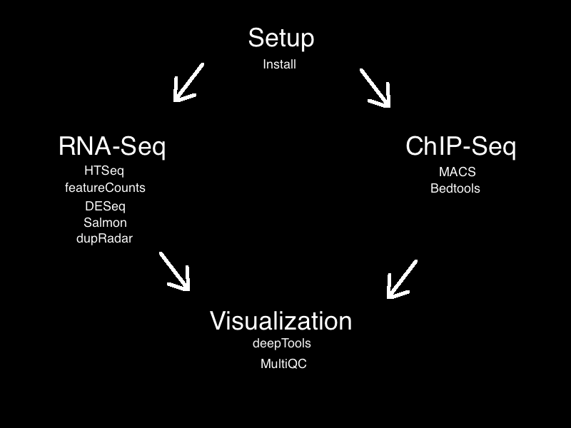

This tutorial works using HISAT2 aligner to align sample reads to a reference.

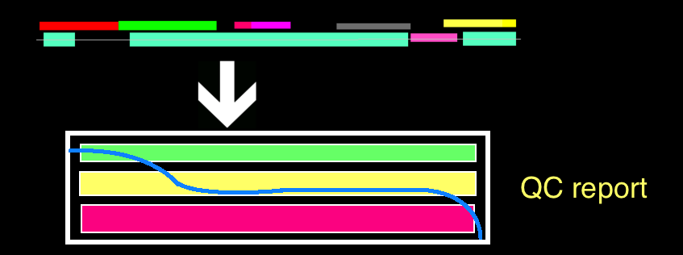

It uses quantification methods (such as salmon for RNA-Seq and peak-calling for ChIP-Seq) to quantify expression and determine protein-binding. 

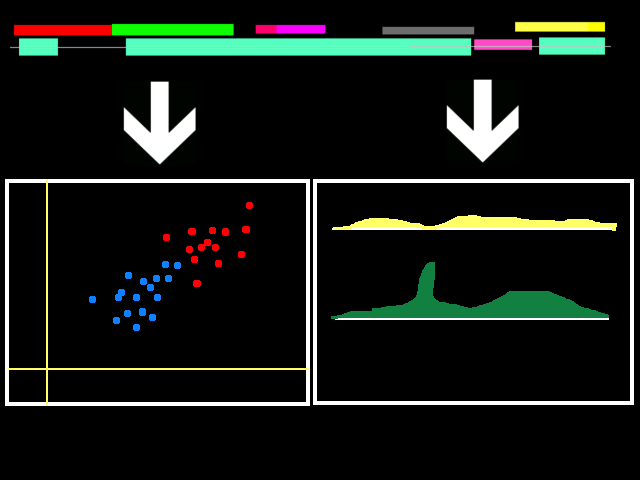

The output is analyzed (differential gene expression for RNA-Seq and peak analysis for ChIP-seq), and the results are visualized.

Then it performs MultiQC to extract quality control information from the aligned reads.

The model organism for this project is Yeast i.e. <i>Saccharomyces cerevisiae</i>. For RNA-Seq, yeast data between euploid and aneuoploid conditions will be compared. For ChIP-Seq, yeast data between 3AT-treated and untreated conditions will be compared.

## How do I use SeqAcademy?

1. Identify and open the terminal emulator program on your computer. Mac and Linux systems come with Terminal installed, and Windows systems come with Console. If there isn't one installed, download one online. 

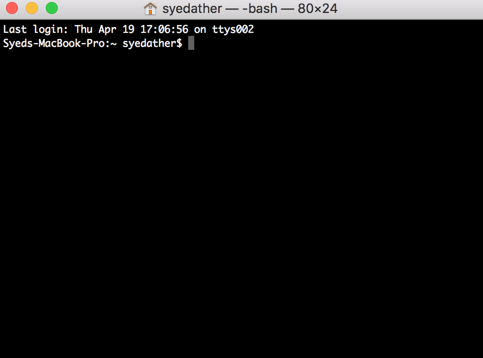

2. Type `pwd` and press enter. This command shows what your current working directory is. Typing commands and pressing enter will be the primary way of running commands in this tutorial. Type `ls` to display which directories and files are in this current directory. 

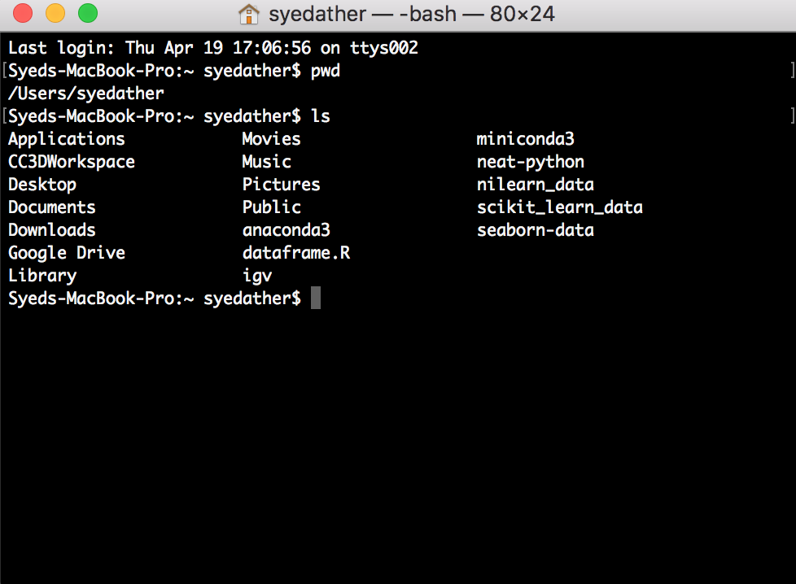

3. If you'd like to use the tutorial in this current working directory, skip to step 5. Otherwise, you may make a new directory or move to another one. To make a new directory, run `mkdir DIRECTORY` in which DIRECTORY is the name of the directory you'd like to make. To move to another directory, run `cd DIRECTORY` in which DIRECTORY is the name of the DIRETORY you'd like to move to. To move up a directory, run `cd ..`. 

4. Given the disk space and RAM requirements, it's likely you'll want to use a virtual machine for this tutorial. To connect to a virtual machine, make sure you use your own domain name or IP address. 

If you know the hostname you'd like to connect to, run `ssh -L PORTNUMBER:localhost:PORTNUMBER USERNAME@HOSTNAME` in which PORTNUMBER is a chosen unique identifable number, USERNAME is your username, and HOSTNAME is your hostname. 

If you know the IP you'd like to connect to, run `ssh -L PORTNUMBER:localhost:PORTNUMBER USERNAME@IP` in which IP is the IP address of the machine you wish to connect to.

5. Download anaconda (https://www.anaconda.com/download/) and git (https://git-scm.com/downloads).

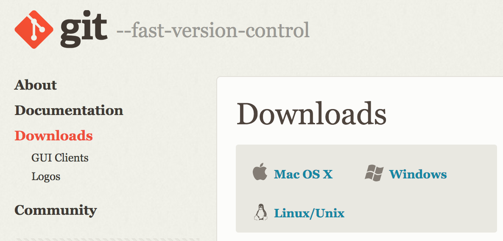 

6. Run `git clone https://github.com/NCBI-Hackathons/seqacademy.git` to clone the directory such that you can download the tutorial. This will download a folder called `seqacademy`.

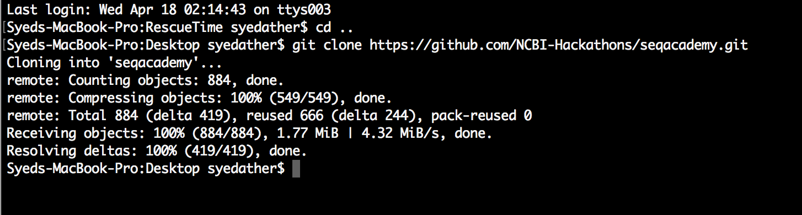

7. Before running any programs, we'll make sure that each software is installed correctly. This tutorial uses Bioconda (https://bioconda.github.io/). Bioconda is a channel for the conda package manager specializing in bioinformatics software. The available packages are listed here: https://bioconda.github.io/recipes.html#recipes.

You will need to add the bioconda channel as well as the other channels bioconda depends on. It is important to add them in this order so that the priority is set correctly (that is, bioconda is highest priority).

The conda-forge channel contains many general-purpose packages not already found in the defaults channel. The r channel is only included due to backward compatibility. It is not mandatory, but without the r channel packages compiled against R 3.3.1 might not work.

This tutorial uses cells written in python and unix to perform its analyses. Lines that are written in unix are prefixed by an exclamation point.

Select the following cell and run it. To run a cell, select the cell, click "Cell" the upper taskbar, and select "Run Cells". Or click the cell and press shift + enter. Alternatively, the contents of any cell may be copy+pasted into the terminal emulator to run.

The `--add channels` is an option that is supplied to the command ot tell it to add certain channels that you specify. The way it is written, the channels "defaults", "conda-forge", and "bioconda", would be added in that order.

Run the following three lines in command line in the following order:

`conda config --add channels defaults`
`conda config --add channels conda-forge`
`conda config --add channels bioconda`

In this tutorial we will create an environment named "tutorial" and install the packages in there. Environments offer ways of installing packages in specific environments so they can be managed and run for different specifications. You can create, export, list, remove and update environments that have different versions of Python and/or packages installed in them. Switching or moving between environments is called activating the environment. You can also share an environment file.

This command will create an environment "tutorial" in which to install the packages used in this tutorial.

Run the following commands to create the environment. The `-n` flag specifies the name of the environment to create (which is called "tutorial") and the list of packages following the name are the packages that will be installed in the "tutorial" environment. This will most likely take 10-15 minutes.

`conda create -n tutorial jupyter hisat2 multiqc macs2 bioconductor-deseq2 matplotlib ggplot samtools bioconductor-rsamtools bedtools htseq  --yes`

Then activate the environment with the following command:

For Mac and Linux

`source activate tutorial` 

or 

`conda activate tutorial`

For Windows

`activate tutorial`

# Begin the tutorial

8. Follow the instructions in `rnaseq.md` or `chipseq.md` for the corresponding tutorial.

## RNA-Seq

The following data presents the RNA-Seq data used in this tutorial. This tutorial observes RNA-Seq data of aneuploidy in Yeast (source: https://www.ncbi.nlm.nih.gov/Traces/study/?acc=SRP106028).

|              |            |        |        |            |            |             |           |           |            |            |             |             |         |                    |                    |            |                     |               |                  |                |            |                          |          |             |           |             |        | 
|--------------|------------|--------|--------|------------|------------|-------------|-----------|-----------|------------|------------|-------------|-------------|---------|--------------------|--------------------|------------|---------------------|---------------|------------------|----------------|------------|--------------------------|----------|-------------|-----------|-------------|--------| 
| BioSample    | Experiment | MBases | MBytes | Run        | SRA_Sample | Sample_Name | karyotype | replicate | Assay_Type | AvgSpotLen | BioProject  | Center_Name | Consent | DATASTORE_filetype | DATASTORE_provider | InsertSize | Instrument          | LibraryLayout | LibrarySelection | LibrarySource  | LoadDate   | Organism                 | Platform | ReleaseDate | SRA_Study | source_name | strain | 
| SAMN06859211 | SRX2775581 | 1632   | 575    | SRR5494627 | SRS2158877 | GSM2595338  | Aneuploid | First     | RNA-Seq    | 51         | PRJNA385090 | GEO         | public  | sra                | ncbi               | 0          | Illumina HiSeq 2500 | SINGLE        | cDNA             | TRANSCRIPTOMIC | 2017-05-02 | Saccharomyces cerevisiae | ILLUMINA | 2017-09-12  | SRP106028 | Yeast cells | S288c  | 
| SAMN06859210 | SRX2775582 | 940    | 331    | SRR5494628 | SRS2158878 | GSM2595339  | Aneuploid | Second    | RNA-Seq    | 51         | PRJNA385090 | GEO         | public  | sra                | ncbi               | 0          | Illumina HiSeq 2500 | SINGLE        | cDNA             | TRANSCRIPTOMIC | 2017-05-02 | Saccharomyces cerevisiae | ILLUMINA | 2017-09-12  | SRP106028 | Yeast cells | S288c  | 
| SAMN06859209 | SRX2775583 | 1195   | 421    | SRR5494629 | SRS2158879 | GSM2595340  | Aneuploid | Third     | RNA-Seq    | 51         | PRJNA385090 | GEO         | public  | sra                | ncbi               | 0          | Illumina HiSeq 2500 | SINGLE        | cDNA             | TRANSCRIPTOMIC | 2017-05-02 | Saccharomyces cerevisiae | ILLUMINA | 2017-09-12  | SRP106028 | Yeast cells | S288c  | 
| SAMN06859208 | SRX2775584 | 815    | 288    | SRR5494630 | SRS2158880 | GSM2595341  | Euploid   | First     | RNA-Seq    | 51         | PRJNA385090 | GEO         | public  | sra                | ncbi               | 0          | Illumina HiSeq 2500 | SINGLE        | cDNA             | TRANSCRIPTOMIC | 2017-05-02 | Saccharomyces cerevisiae | ILLUMINA | 2017-09-12  | SRP106028 | Yeast cells | S288c  | 
| SAMN06859207 | SRX2775585 | 946    | 333    | SRR5494631 | SRS2158881 | GSM2595342  | Euploid   | Second    | RNA-Seq    | 51         | PRJNA385090 | GEO         | public  | sra                | ncbi               | 0          | Illumina HiSeq 2500 | SINGLE        | cDNA             | TRANSCRIPTOMIC | 2017-05-02 | Saccharomyces cerevisiae | ILLUMINA | 2017-09-12  | SRP106028 | Yeast cells | S288c  | 
| SAMN06859206 | SRX2775586 | 1152   | 407    | SRR5494632 | SRS2158882 | GSM2595343  | Euploid   | Third     | RNA-Seq    | 51         | PRJNA385090 | GEO         | public  | sra                | ncbi               | 0          | Illumina HiSeq 2500 | SINGLE        | cDNA             | TRANSCRIPTOMIC | 2017-05-02 | Saccharomyces cerevisiae | ILLUMINA | 2017-09-12  | SRP106028 | Yeast cells | S288c  | 

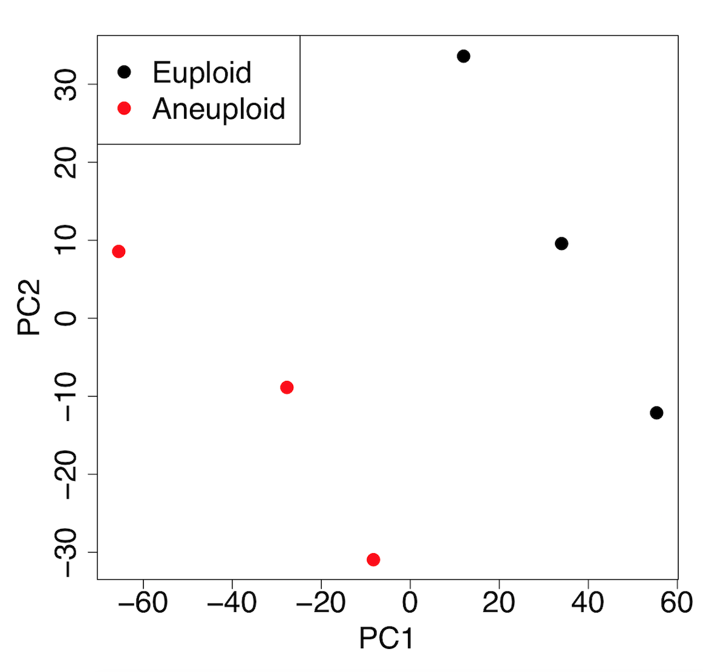

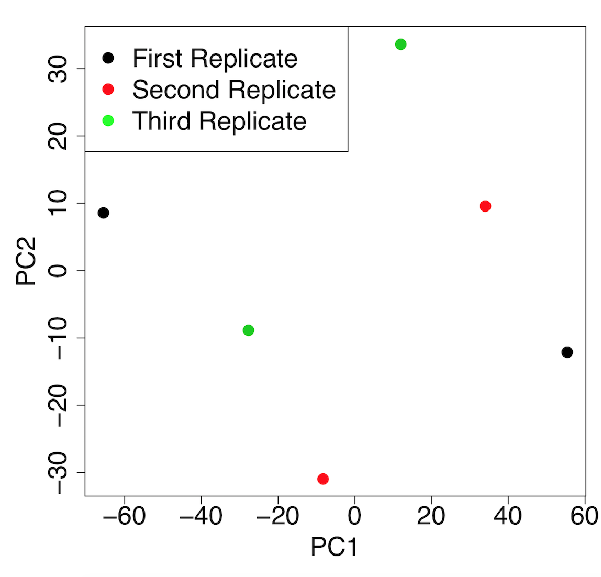

Principal component analysis (PCA) suggests gene expression for euploid yeast samples (haploid) clusters distinctly from that of the aneuploid yeast samples (diploid chromosome X).The first two PCs account for ~70% of the variance in expressed genes). Data provided by Mulla et al. (https://elifesciences.org/articles/27991). 

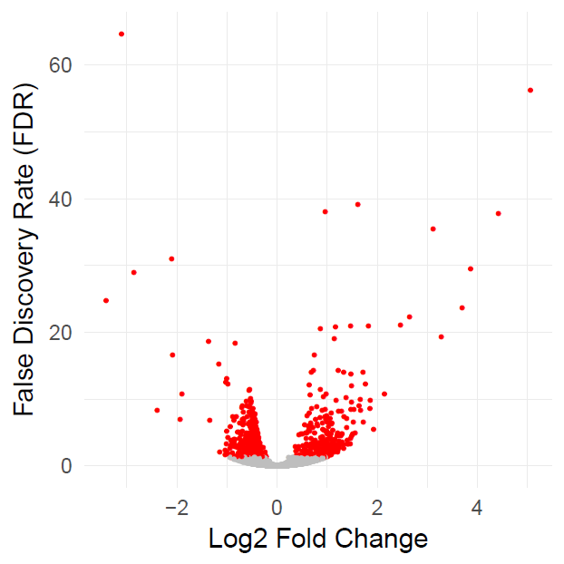

A volcano plot of differentially expressed genes between euploid yeast colonies versus aneuploid yeast colonies. The x-axis represents the difference in gene expression between the conditions. False discovery rate (FDR), a method for controlling for multiple testing, is along the y-axis. Each point represents a tested gene (N=3,926). Red points are those reaching genome-wide significance (at FDR<0.05, N=663), whereas grey points are genes not reaching statistical significance (FDR>0.05, N=3,263). Data provided by Mulla et al. (https://elifesciences.org/articles/27991). 

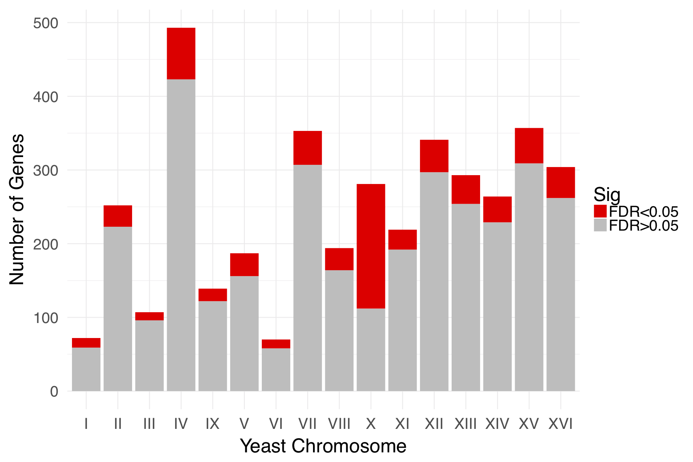

The relative enrichment of chrX for differentially expressed genes suggests the downstream results of this processing pipeline are consistent with biological expectations. The RNA-seq experiment was performed on yeast colonies with an extra chromosome X. Data provided by Mulla et al. (https://elifesciences.org/articles/27991). 

# ChIP-Seq

The following data presents the ChIP-Seq data used in this tutorial. This tutorial observes ChIP-Seq data of induction by 3-AT in Yeast (source: https://www.ncbi.nlm.nih.gov/Traces/study/?acc=SRP132584).

|            |              |            |        |        |            |            |             |                                               |                        |        |            |             |             |         |                    |                    |            |             |               |                  |                |            |                          |          |             |           | 
|------------|--------------|------------|--------|--------|------------|------------|-------------|-----------------------------------------------|------------------------|--------|------------|-------------|-------------|---------|--------------------|--------------------|------------|-------------|---------------|------------------|----------------|------------|--------------------------|----------|-------------|-----------| 
| AvgSpotLen | BioSample    | Experiment | MBases | MBytes | Run        | SRA_Sample | Sample_Name | genotype                                      | source_name            | strain | Assay_Type | BioProject  | Center_Name | Consent | DATASTORE_filetype | DATASTORE_provider | InsertSize | Instrument  | LibraryLayout | LibrarySelection | LibrarySource  | LoadDate   | Organism                 | Platform | ReleaseDate | SRA_Study | 
| 148        | SAMN08513506 | SRX3677830 | 8816   | 3690   | SRR6703656 | SRS2938492 | GSM2991004  | MATa ade2-1 can1-100 leu2-3,112 trp1-1 ura3-1 | Untreated              | YDC111 | RNA-Seq    | PRJNA433659 | GEO         | public  | sra                | ncbi               | 0          | NextSeq 500 | PAIRED        | cDNA             | TRANSCRIPTOMIC | 2018-02-09 | Saccharomyces cerevisiae | ILLUMINA | 2018-02-27  | SRP132584 | 
| 148        | SAMN08513513 | SRX3677835 | 9614   | 4022   | SRR6703661 | SRS2938497 | GSM2991009  | MATa ade2-1 can1-100 leu2-3,112 trp1-1 ura3-1 | 3AT-treated for 40 min | YDC111 | RNA-Seq    | PRJNA433659 | GEO         | public  | sra                | ncbi               | 0          | NextSeq 500 | PAIRED        | cDNA             | TRANSCRIPTOMIC | 2018-02-09 | Saccharomyces cerevisiae | ILLUMINA | 2018-02-27  | SRP132584 | 
| 150        | SAMN08513512 | SRX3677836 | 6049   | 2749   | SRR6703662 | SRS2938498 | GSM2991010  | MATa ade2-1 can1-100 leu2-3,112 trp1-1 ura3-1 | Untreated              | YDC111 | RNA-Seq    | PRJNA433659 | GEO         | public  | sra                | ncbi               | 0          | NextSeq 500 | PAIRED        | cDNA             | TRANSCRIPTOMIC | 2018-02-09 | Saccharomyces cerevisiae | ILLUMINA | 2018-02-27  | SRP132584 | 
| 150        | SAMN08513511 | SRX3677837 | 6918   | 3140   | SRR6703663 | SRS2938499 | GSM2991011  | MATa ade2-1 can1-100 leu2-3,112 trp1-1 ura3-1 | 3AT-treated for 40 min | YDC111 | RNA-Seq    | PRJNA433659 | GEO         | public  | sra                | ncbi               | 0          | NextSeq 500 | PAIRED        | cDNA             | TRANSCRIPTOMIC | 2018-02-09 | Saccharomyces cerevisiae | ILLUMINA | 2018-02-27  | SRP132584 | 

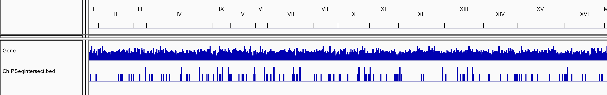

Distribution of intersected peaks across the yeast genome. This IGV screenshot shows in the bottom row the intersected peaks between the two treatment conditions of the yeast samples. The matching genes with each intersected peak can be analyzed. 

# Authors
+ Syed Hussain Ather (shussainather@gmail.com) (http://hussainather.com)
+ Olaitan Awe (laitanawe@gmail.com)
+ TJ Butler (tjbutler003@gmail.com)
+ Tamiru Denka (tamiru.dank@nih.gov)
+ Stephen Semick (stephen.semick@libd.org)
+ Wanhu Tang (tangw2@niaid.nih.gov)
